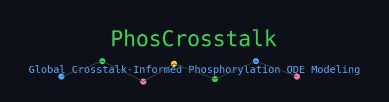

 

<p align="left">


</p>

# **PhosCrosstalk**

**Global phospho-network ODE modeling with PTM-based crosstalk integration and evolutionary parameter optimization**

PhosCrosstalk is a systems-level phosphorylation modeling framework that integrates **PTMcode2-derived inter/intra crosstalk**, **pynetphorest predicted residue-level interactions**, and **experimental phosphosite time-series** into a single unified **global ODE model**.
It reconstructs protein activation and phosphosite kinetics across an entire network, using **parallel Differential Evolution (pymoo)** or **Scipy SLSQP** to fit large parameter sets efficiently and robustly.

PhosCrosstalk provides a full end-to-end pipeline:

* Build global crosstalk adjacency matrices from predicted PTM interactions
* Construct local proximity matrices from intra-protein residue distances
* Fit protein-level activation and deactivation rates
* Fit site-level phosphorylation and dephosphorylation kinetics
* Simulate complete FC trajectories for every phosphosite
* Evaluate model fit through goodness-of-fit plots and time-series reconstruction
* Export all fitted parameters, timeseries, and matrices for downstream analysis

---

---

# **Key Features**

### **1. Global ODE phosphorylation model**

Each protein has an activation state `S_k(t)`; each phosphosite has a phosphorylation fraction `p_i(t)`.
The model integrates:

* **Protein activation/deactivation** (`k_act`, `k_deact`)
* **Site-specific phosphorylation/dephosphorylation** (`k_on`, `k_off`)
* **Global crosstalk terms** from PTMcode2 residue interactions (`β_g * Cg * p`)
* **Local proximity terms** from residue distances (`β_l * Cl * p`)

The result is a multilayer coupled ODE capturing network-driven phosphorylation dynamics.

---

### **2. Inter/Intra Crosstalk Integration**

Crosstalk matrices (`Cg`) are built from PTMcode2-style SQLite DBs:

* **Inter-protein crosstalk** – “Protein1 Residue ↔ Protein2 Residue”
* **Intra-protein crosstalk** – “Residue ↔ Residue” pairs within the same protein

Scores are normalized and assembled into a global interaction matrix aligned to your phosphosite dataset.

---

### **3. Local residue proximity**

A local matrix (`Cl`) computes proximity-based influence:

$$
Cl_{ij} = e^{-|position_i - position_j| / L}
$$

This captures short-range sequence-based coupling within proteins.

---

### **4. Parallel Evolutionary Optimization (pymoo)**

PhosCrosstalk can fit **100–300+ parameters** using:

* Differential Evolution
* Multi-core parallel evaluation
* Log-space parameter transforms for numerical stability

This avoids local minima and discovers sharper biological kinetic regimes.

A fallback **Scipy SLSQP** mode provides fast, smooth local fits.

---

### **5. Time-Series Reconstruction**

After fitting, the model reconstructs:

* Normalized phosphorylation dynamics
* Re-scaled fold-change time series
* Per-site and per-protein trajectories

Results include:

* `fit_timeseries.tsv`
* `goodness_of_fit.png`
* `fitted_params.npz`

---

### **6. Crosstalk-based site filtering**

You can restrict modeling to only the sites present in a `crosstalk_predictions.tsv`, enabling:

* network-focused ODE models
* domain-specific phosphosite subsets
* curated reconstructions for specific modules (e.g., EGFR cluster, IRS1 cluster)

---

---

# **Repository Structure**

```
phoscrosstalk/
│
├── build_C_from_ptmcode2.py        # Build Cg matrix from PTMcode2 & pynetphorest
├── fit_network_protein_pymoo.py    # Full ODE model + DE/SLSQP optimization
├── scripts/
│   └── print_params.py             # Pretty-print NPZ parameter archives
│
├── data/                           # Your time-series inputs (user-supplied)
├── ptm_db/                         # SQLite PTMcode2-like inter/intra DBs
│
├── results/                        # Output folder (created automatically)
│   ├── fitted_params.npz
│   ├── fit_timeseries.tsv
│   ├── goodness_of_fit.png
│   └── logs/
│
└── README.md
```

---

# **Installation**

PhosCrosstalk requires Python ≥ 3.10.

```
git clone https://github.com/<yourname>/phoscrosstalk.git
cd phoscrosstalk

python -m venv venv
source venv/bin/activate

pip install -r requirements.txt
```

If you want evolutionary optimization:

```
pip install pymoo
```

---

# **Input Requirements**

### **Time-Series File**

CSV/TSV containing columns:

* `Protein` or `GeneID`
* `Residue` or `Psite`
* Value columns: `v0`, `v1`, ..., `v13` (14 time points)

### **PTM Crosstalk Databases**

Two SQLite files:

* `intra_pairs` table:
  `(protein, residue1, score1, residue2, score2)`
* `inter_pairs` table:
  `(protein1, residue1, score1, protein2, residue2, score2)`

### **Optional: Crosstalk Filter File**

`crosstalk_predictions.tsv` with:

* `Protein`
* `Site1`
* `Site2`

This restricts your dataset to only the phosphosites predicted as interacting.

---

# **Usage**

### **1. Build Crosstalk Matrices**

```
python build_C_from_ptmcode2.py \
    --intra ptm_db/intra.sqlite \
    --inter ptm_db/inter.sqlite \
    --out Cg.npz
```

### **2. Fit the ODE Model**

Using pymoo:

```
python fit_network_protein_pymoo.py \
    --data data/timeseries.csv \
    --ptm-intra ptm_db/intra.sqlite \
    --ptm-inter ptm_db/inter.sqlite \
    --crosstalk-tsv data/crosstalk_predictions.tsv \
    --method pymoo \
    --cores 8 --pop 50 --gen 100 \
    --outdir results/
```

Using SLSQP:

```
python fit_network_protein_pymoo.py \
    --data data/timeseries.csv \
    --ptm-intra ptm_db/intra.sqlite \
    --ptm-inter ptm_db/inter.sqlite \
    --method slsqp \
    --outdir results/
```

---

# **Output Files**

### **`fitted_params.npz`**

Contains:

* proteins
* sites
* site_prot_idx
* positions
* k_act
* k_deact
* beta_g
* beta_l
* k_on
* k_off
* baselines
* amplitudes

### **`fit_timeseries.tsv`**

Observed FC vs simulated FC at each timepoint for every site.

### **`goodness_of_fit.png`**

Scatter plot of simulated vs observed fold changes.

---

# **Model Summary**

The ODE captures phosphorylation as:

$$
\frac{dS_k}{dt}
= k^{act}_k (1 - S_k) - k^{deact}_k S_k
$$

and for each phosphosite \(i\):

$$
\frac{dp_i}{dt}
= ( k_{on,i} \, S_{\text{prot}(i)} + \beta_g (C_g p)_i + \beta_l (C_l p)_i )(1 - p_i) - k_{off,i} \, p_i
$$

This structure allows:

* protein-level activation waves
* site-level dynamics shaped by crosstalk
* long-range PTM influence
* local residue proximity contributions

---

# **Why PhosCrosstalk Exists**

Phosphorylation is not isolated. Sites influence each other across:

* protein domains
* protein complexes
* signaling cascades
* PTM interaction networks

Most modeling approaches treat sites independently or only use kinase–substrate data.
PhosCrosstalk closes the gap: it integrates **global PTM relationships**, **local sequence context**, and **experimental time-series**, giving a mechanistic, quantitative reconstruction of network-level phosphorylation dynamics.

This creates a bridge between:

✔ dynamic ODE modeling
✔ phosphoproteomics
✔ PTM curation databases
✔ machine-learning residue prediction tools

---

# **Citation**
