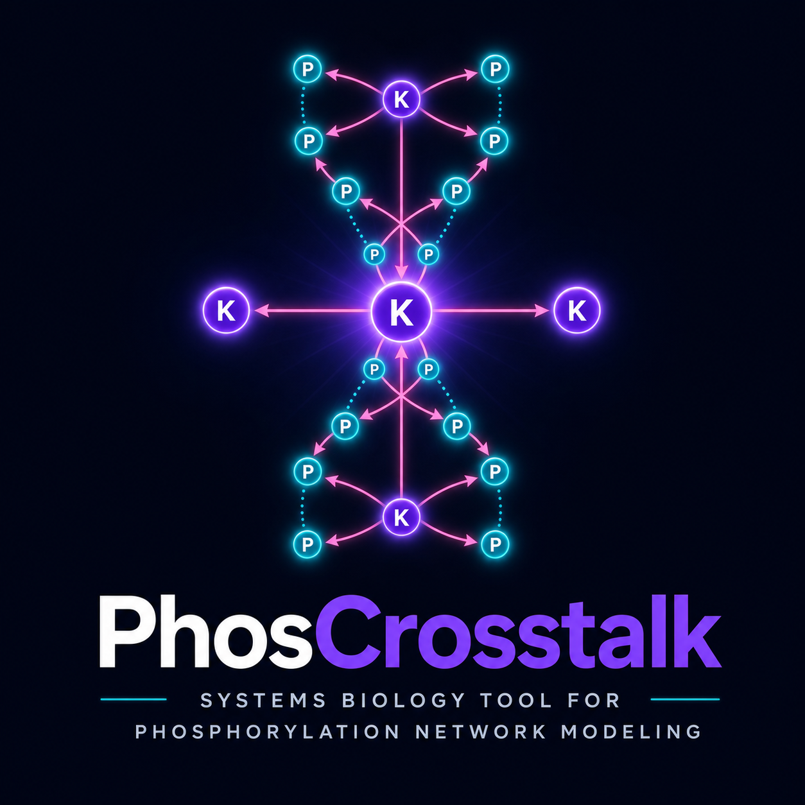

<p align="center">
  
</p>

<p align="center">
  
  
</p>

# PhosCrosstalk

Global phospho-network ODE modeling with PTM-based crosstalk integration and multi-objective evolutionary optimization.

PhosCrosstalk is a systems-level phosphorylation modeling framework that integrates PTMcode2-derived inter/intra-crosstalk, KEA3 kinase-substrate networks, and experimental phosphosite time-series into a unified global ODE model.

It reconstructs protein activation, kinase activity, and phosphosite kinetics across a network. Large parameter sets are fitted using parallel multi-objective evolutionary algorithms through `pymoo`.

## Overview

PhosCrosstalk provides an end-to-end pipeline for:

- automated biological data curation
- kinase-substrate and PTM crosstalk network construction
- global ODE-based phosphosite modeling
- multi-objective parameter optimization
- steady-state simulation
- in-silico knockout analysis
- global sensitivity analysis
- interactive visualization through Streamlit

> [!NOTE]
> PhosCrosstalk is designed for network-level phosphoproteomics modeling, not isolated single-site curve fitting. It is most useful when phosphosite time-series data can be connected to kinase-substrate and PTM crosstalk priors.

## Key features

### Global phospho-network ODE model

The model captures three coupled biological layers:

- `S`: protein activation state
- `K_dyn`: dynamic kinase activity
- `p`: phosphosite occupancy

The ODE system integrates:

- kinase-substrate phosphorylation
- PTMcode2-derived global crosstalk
- local sequence-based phosphosite proximity
- distributive, sequential, and random/cooperative kinetic mechanisms

### Automated data curation

The curator module processes biological prior knowledge into model-ready artifacts.

It supports:

- KEA and PhosphoSitePlus data acquisition
- PTMcode2 within-protein and between-protein crosstalk processing
- SQLite database generation for PTM lookups
- unified kinase graph construction
- kinase-substrate lookup table generation

### Multi-objective optimization

PhosCrosstalk formulates parameter fitting as a multi-objective optimization problem.

The objectives include:

1. phosphosite trajectory error
2. protein abundance error
3. model complexity regularization

Supported optimization strategies include NSGA-II and UNSGA-III through `pymoo`.

### Post-optimization analysis

After fitting, PhosCrosstalk can run:

- steady-state convergence analysis
- kinase, protein, and phosphosite knockouts
- fold-change impact screening
- Sobol global sensitivity analysis
- Pareto-front trajectory selection using Fréchet distance

### Interactive dashboard

The Streamlit dashboard supports:

- fitted trajectory inspection
- observed vs simulated comparisons
- parameter distribution exploration
- sensitivity ranking visualization
- knockout result exploration
- dynamic kinase-network animation

## Repository structure

```text
phoscrosstalk/
├── __init__.py
├── main.py
├── data_curator.py
├── core_mechanisms.py
├── optimization.py
├── simulation.py
├── analysis.py
├── sensitivity.py
├── knockouts.py
├── app.py
└── README.md
````

## Installation

PhosCrosstalk requires Python 3.10 or newer.

```bash
git clone https://github.com/<yourname>/phoscrosstalk.git
cd phoscrosstalk

python -m venv venv
source venv/bin/activate

pip install -r requirements.txt
```

Main dependencies:

```text
numpy
scipy
pandas
numba
pymoo
networkx
salib
streamlit
rich
```

> [!TIP]
> For large optimization runs, use a clean virtual environment and run the pipeline on a machine with sufficient CPU cores and memory.

## Data curation

Before running the model, biological prior knowledge must be curated.

### PTMcode2 files

Download the PTMcode2 within-protein and between-protein files from the PTMcode website and place them in a local directory, for example:

```text
data/ptmcode2/
├── within.gz
└── between.gz
```

### Run the curator

```bash
python3 -m phoscrosstalk.data_curator \
  --all \
  --ptmcode data/ptmcode2/within.gz data/ptmcode2/between.gz
```

Curated outputs are written to:

```text
data_curated/processed/
```

Expected curated artifacts include:

```text
ptm_intra.db
ptm_inter.db
ks_psite_table.tsv
unified_kinase_graph.gpickle
```

> [!IMPORTANT]
> The modeling pipeline expects curated PTM and kinase-substrate artifacts before optimization. Run data curation first unless these files already exist.

## Usage

### Run the modeling pipeline

```bash
phoscrosstalk \
  --data data_timeseries/filtered_input1.csv \
  --ptm-intra data_curated/processed/ptm_intra.db \
  --ptm-inter data_curated/processed/ptm_inter.db \
  --kea-ks-table data_curated/processed/ks_psite_table.tsv \
  --unified-graph-pkl data_curated/processed/unified_kinase_graph.gpickle \
  --outdir results/experiment_01 \
  --cores 16 \
  --mechanism rand \
  --gen 300 \
  --run-steadystate \
  --run-knockouts \
  --run-sensitivity
```

### Run the dashboard

```bash
streamlit run phoscrosstalk/app.py
```

In the dashboard sidebar, select the output directory from a completed run, for example:

```text
results/experiment_01
```

## Output files

A typical run generates:

```text
results/experiment_01/
├── fit_timeseries.tsv
├── fitted_params.npz
├── pareto_front_with_J.tsv
├── knockouts/
├── sensitivity/
└── equations/
```

Main outputs:

| Output                    | Description                                                 |
| ------------------------- | ----------------------------------------------------------- |
| `fit_timeseries.tsv`      | Observed and simulated trajectories for fitted phosphosites |
| `fitted_params.npz`       | Optimized parameters and model state                        |
| `pareto_front_with_J.tsv` | Objective values for Pareto-optimal solutions               |
| `knockouts/`              | In-silico knockout results and fold-change summaries        |
| `sensitivity/`            | Sobol indices and perturbation trajectories                 |
| `equations/`              | Generated LaTeX representation of the fitted ODE system     |

## Why PhosCrosstalk exists

Phosphorylation is not independent at the site level. Sites can influence each other through protein domains, protein complexes, signaling cascades, and PTM interaction networks.

Many modeling approaches treat phosphosites independently or rely only on kinase-substrate annotations. PhosCrosstalk combines global PTM relationships, local sequence context, and experimental time-series data into one mechanistic modeling framework.

The goal is to connect:

* dynamic ODE modeling
* phosphoproteomics
* PTM curation databases
* kinase-substrate networks
* residue-level prediction and downstream machine learning

## Citation

If you use PhosCrosstalk, cite the relevant biological resources and methods used by the framework.

1. Casado, P., Rodriguez-Prados, J.-C., Cosulich, S. C., Guichard, S., Vanhaesebroeck, B., & Cutillas, P. R. (2013). Kinase-Substrate Enrichment Analysis provides insights into the heterogeneity of signaling pathway activation in leukemia cells. Science Signaling, 6(264), rs6. [https://doi.org/10.1126/scisignal.2003573](https://doi.org/10.1126/scisignal.2003573)

2. Hornbeck, P. V., Zhang, B., Murray, B., Kornhauser, J. M., Latham, V., & Skrzypek, E. (2015). PhosphoSitePlus, 2014: mutations, PTMs and recalibrations. Nucleic Acids Research, 43(D1), D512-D520. [https://doi.org/10.1093/nar/gku1267](https://doi.org/10.1093/nar/gku1267)

3. Horn, H., Schoof, E., Kim, J., Robin, X., Miller, M. L., Diella, F., Palma, A., Cesareni, G., Jensen, L. J., & Linding, R. (2014). KinomeXplorer: an integrated platform for kinome biology studies. Nature Methods, 11(6), 603-604. [https://doi.org/10.1038/nmeth.2968](https://doi.org/10.1038/nmeth.2968)

4. Minguez, P., Letunic, I., Parca, L., & Bork, P. (2013). PTMcode: a database of known and predicted functional associations between post-translational modifications in proteins. Nucleic Acids Research, 41(D1), D306-D311. [https://doi.org/10.1093/nar/gks1230](https://doi.org/10.1093/nar/gks1230)

5. Linding, R., Jensen, L. J., Pasculescu, A., Olhovsky, M., Colwill, K., Bork, P., Yaffe, M. B., & Pawson, T. (2008). NetworKIN: a resource for exploring cellular phosphorylation networks. Nucleic Acids Research, 36(Database issue), D695-D699. [https://doi.org/10.1093/nar/gkm902](https://doi.org/10.1093/nar/gkm902)

## License

This project is licensed under the BSD 3-Clause License.